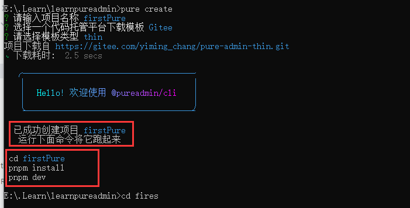
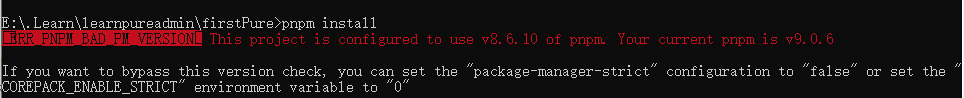
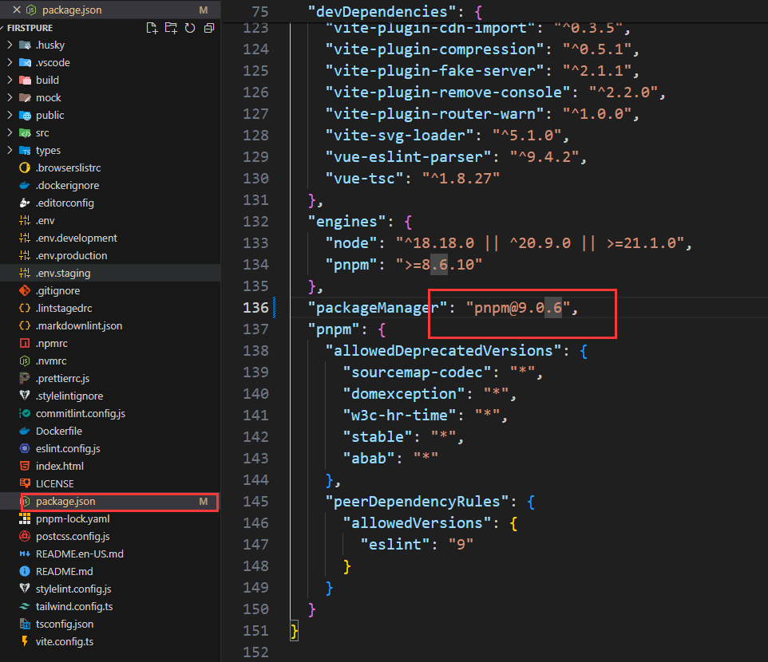
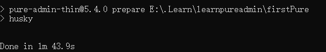
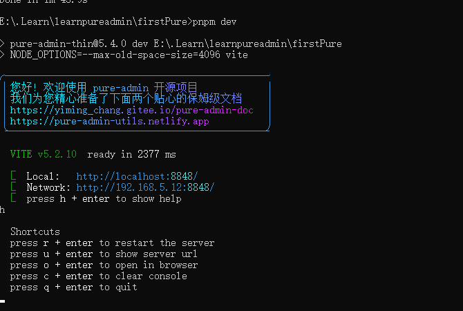
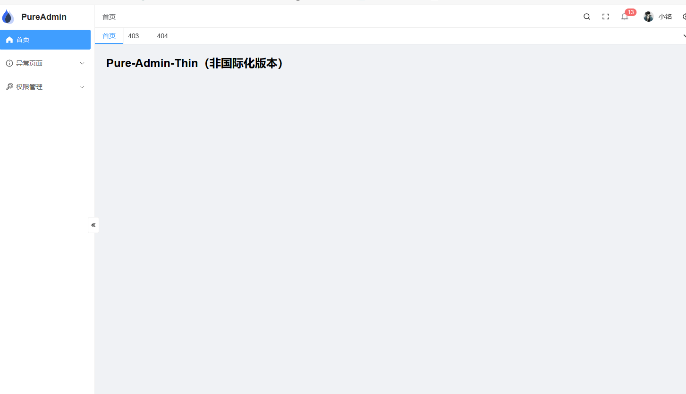
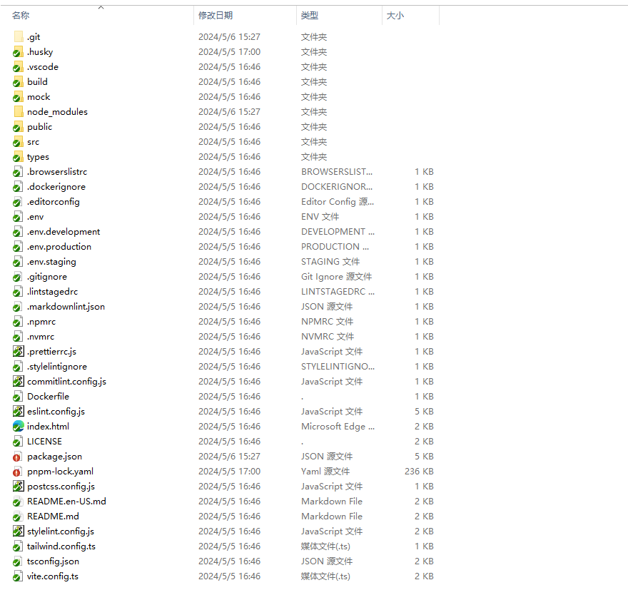
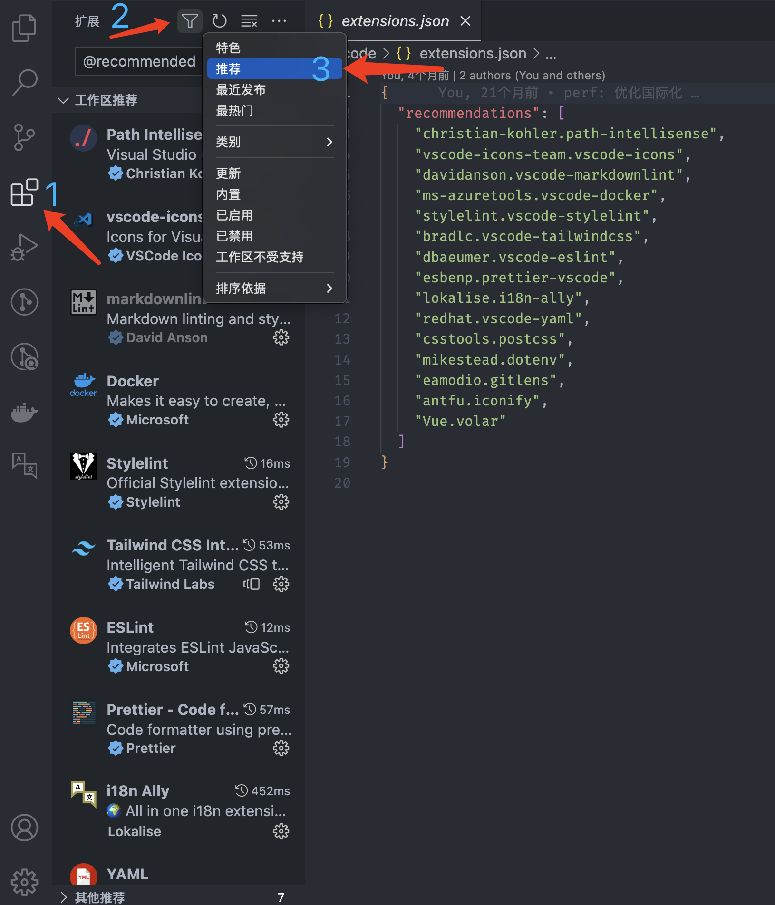
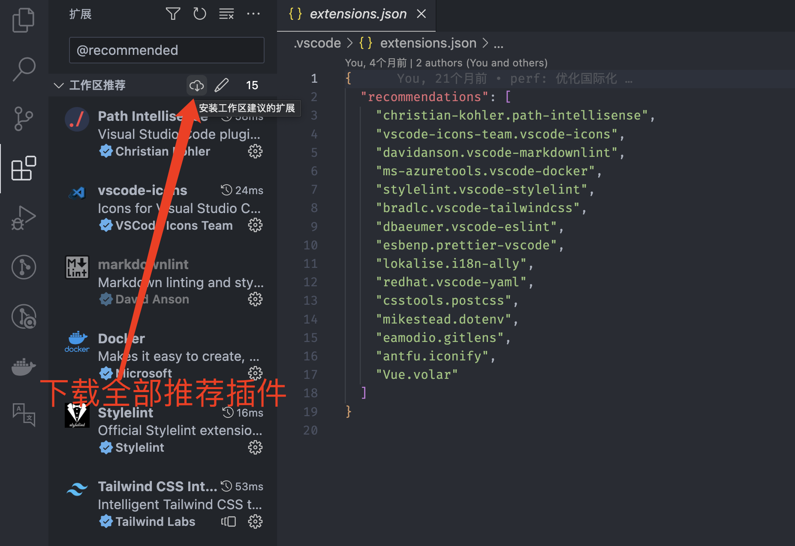

# 介绍

[vue-pure-admin (opens new window)](https://github.com/pure-admin/vue-pure-admin)是一款开源完全免费且开箱即用的中后台管理系统模版。完全采用 `ECMAScript` 模块（`ESM`）规范来编写和组织代码，使用了最新的 `Vue3`、`Vite`、`Element-Plus`、`TypeScript`、`Pinia`、`Tailwindcss` 等主流技术开发

## 开发环境

项目需要 `node` 18.18.0以环境, `pnpm` 版本大于8.6.10
我本地环境为16,所以使用 `nvm` 来下载并使用最新的LTS版本

```cmd
nvm list available // 查看所有可安装版本
nvm install 20.12.2 // 下载指定版本
```

安装pnpm
```cmd
npm install -g pnpm // 安装pnpm
pnpm -v // 验证pnpm是否安装成功
```

安装[pureadmin脚手架](pureadmin脚手架.md)
```cmd
npm install -g @pureadmin/cli
```

## 创建项目

个人的二次开发项目，不需要创建完整项目示例，先创建最基本的项目框架，然后根据需要不断填充

```cmd
pure creatre
```
之后按照代码提示操作就好




下载时报错


> ERR_PNPM_BAD_PM_VERSION  This project is configured to use v8.6.10 of pnpm. Your current pnpm is v9.0.6
> If you want to bypass this version check, you can set the "package-manager-strict" configuration to "false" or set the "COREPACK_ENABLE_STRICT" environment variable to "0"

版本不对。下载器一般换个版本不会出什么问题，我直接修改package.json里的配置再尝试一下


再次pnpm install ,成功


## 启动项目

```cmd
pnpm dev
```



根据提示 按下h然后回车查看帮助
然后按下o回车打开浏览器



成功

## 项目目录


大概看一眼就好。

此时注意：

 .git 是拉去项目时生成的文件夹，我之后不打算继续跟踪上游更新，而是保持该版本进行二次开发，所以之后会删除该文件夹
 
.husky 是git工作流钩子的插件husky的文件夹.[Husky (typicode.github.io)](https://typicode.github.io/husky/)。其中配置了该项目的提交工作流，如果需要用git管理该项目，需要注意其中的配置，按需修改。

.vscode是使用vscode开发项目时生成的文件夹，保存了vscode编辑器的插件和配置项。该文件夹是pureadmin作者为了同步和简化开发环境而提交上去的，如果刚使用vscode不久，可以按照这个环境进行配置。如果已经有自己的习惯，则没有太大必要修改



## 成功

此时，项目框架已搭建成功，后续准备进行一些常用功能的开发和该项目使用的相关技术的学习。